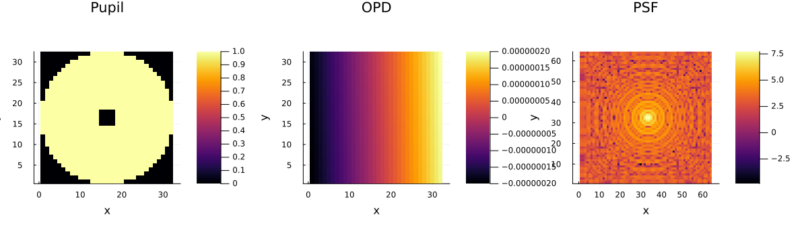
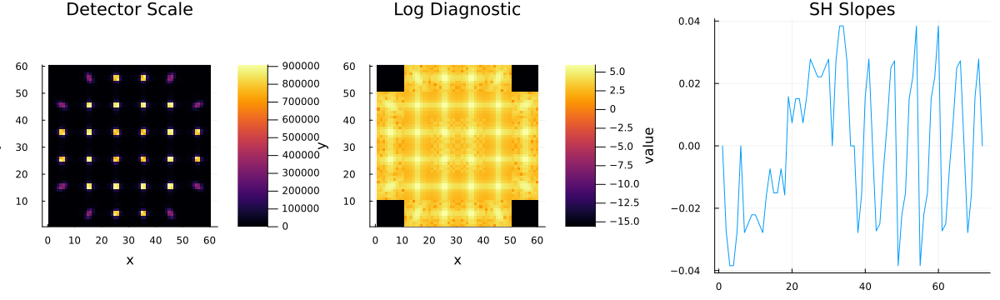
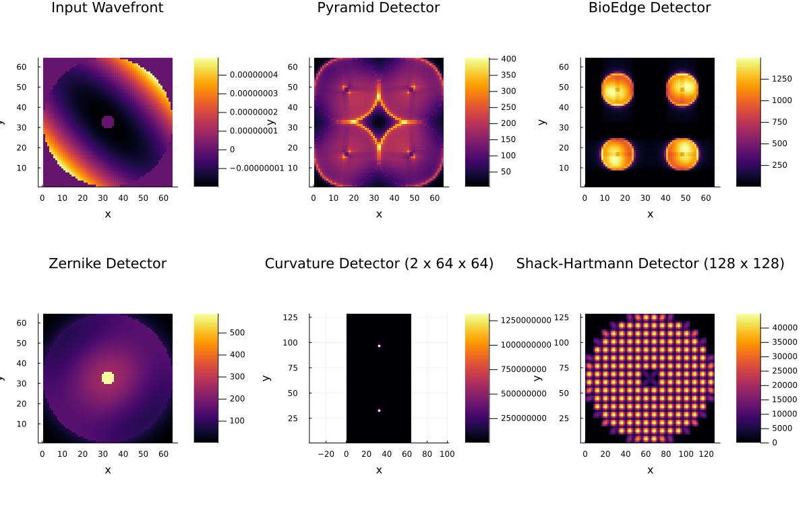

# AdaptiveOpticsSimPlots.jl

Optional plotting companion package for `AdaptiveOpticsSim.jl`.

This package keeps plotting out of the simulation core and provides a small,
maintained `Plots.jl` surface built on top of stable `AdaptiveOpticsSim`
accessors.

The plotting package is also the maintained home for full visual examples.
The core `AdaptiveOpticsSim.jl` examples stay plotting-free by design.

## API

The public plotting entrypoint is `aoplot`. Plot intent is selected with small
dispatchable selector types:

- `aoplot`
- `Pupil`
- `OPD`
- `PSF`
- `ScienceFrame`
- `DetectorFrame`
- `WFSFrame`
- `ShackHartmannDetectorFrame`
- `Commands`
- `Signal`
- `RuntimeTimeseries`
- `shack_hartmann_detector_image`

Examples:

```julia
aoplot(tel, Pupil())
aoplot(tel, OPD())
aoplot(psf, PSF())
aoplot(detector, DetectorFrame())
aoplot(wfs, DetectorFrame())
aoplot(wfs, WFSFrame())
aoplot(shack_hartmann, ShackHartmannDetectorFrame())
aoplot(dm, Commands())
aoplot(dm, OPD())
aoplot(runtime, ScienceFrame())
aoplot(runtime, Signal())
```

The package intentionally uses the explicit `aoplot(obj, selector)` entrypoint
instead of extending `Plots.plot` for `AdaptiveOpticsSim.jl` types. That keeps
the plotting API small, makes plot intent explicit, and avoids surprising
method dispatch for users who also use `Plots.jl` directly.

For WFS detector images, `aoplot(wfs, DetectorFrame())` renders the core
`AdaptiveOpticsSim.wfs_detector_image` product. Pyramid, BioEdge, Zernike, and
Curvature sensors render their maintained 2-D camera/readout frames.
Shack-Hartmann renders the core detector mosaic assembled from its lenslet spot
cube. If the detector was configured with a typed digital export such as
`Detector(bits=12, full_well=30_000.0, output_type=UInt16)`, the plot displays
that already-quantized ADU image; plotting does not rescale or reinterpret the
detector output contract. Shack-Hartmann detector mosaics default to adjacent
subaperture images with no artificial separator pixels; pass `gap=N` only for a
diagnostic layout.

## Preview

`examples/image_formation_visual.jl`:



`examples/shack_hartmann_detector_mosaic_visual.jl`:



`examples/wfs_detector_comparison_visual.jl`:



## Install

For sibling-checkout development:

```julia
using Pkg
Pkg.develop(path="../AdaptiveOpticsSim.jl")
Pkg.develop(path="../AdaptiveOpticsSimPlots.jl")
```

## Visual Examples

Focused maintained examples live under `examples/`:

Run any example from the package root with:

```bash
julia --project=. examples/image_formation_visual.jl
```

The quick visual examples are:

- `examples/image_formation_visual.jl`: telescope pupil, OPD, and PSF.
- `examples/detector_visual.jl`: PSF capture through native and sampled detector paths.
- `examples/dm_visual.jl`: grid and sampled DM command/OPD views.
- `examples/wfs_visual.jl`: Pyramid frame plus Pyramid and Shack-Hartmann signals.
- `examples/shack_hartmann_detector_mosaic_visual.jl`: detector-like Shack-Hartmann lenslet spot mosaic.
- `examples/wfs_detector_comparison_visual.jl`: one wavefront viewed through Pyramid, BioEdge, Zernike, Curvature, and Shack-Hartmann detector frames with 64x64 and 128x128-class camera readouts.
- `examples/closed_loop_runtime_visual.jl`: runtime WFS frame, science frame, and signal trace.

The OOPAO-style tutorial examples are:

- `examples/tutorial_image_formation_visual.jl`
- `examples/tutorial_detector_visual.jl`
- `examples/tutorial_closed_loop_shack_hartmann_visual.jl`
- `examples/tutorial_closed_loop_pyramid_visual.jl`
- `examples/tutorial_closed_loop_bioedge_visual.jl`
- `examples/tutorial_closed_loop_zernike_visual.jl`
- `examples/tutorial_asterism_visual.jl`
- `examples/tutorial_spatial_filter_visual.jl`
- `examples/tutorial_transfer_function_visual.jl`
- `examples/tutorial_extended_source_sensing_visual.jl`
- `examples/tutorial_gain_sensing_camera_visual.jl`
- `examples/tutorial_lift_visual.jl`
- `examples/tutorial_ncpa_visual.jl`
- `examples/tutorial_shack_hartmann_subapertures_visual.jl`
- `examples/tutorial_sprint_visual.jl`
- `examples/tutorial_tomography_visual.jl`

The plotted closed-loop helper examples are:

- `examples/closed_loop_demo_visual.jl`
- `examples/platform_single_runtime_visual.jl`
- `examples/platform_grouped_runtime_visual.jl`
- `examples/run_cl_visual.jl`
- `examples/run_cl_first_stage_visual.jl`
- `examples/run_cl_from_phase_screens_visual.jl`
- `examples/run_cl_long_push_pull_visual.jl`
- `examples/run_cl_sinusoidal_modulation_visual.jl`
- `examples/run_cl_two_stages_visual.jl`
- `examples/run_cl_two_stages_atm_change_visual.jl`
- `examples/run_cl_zernike_visual.jl`

These are plain Julia scripts and are directly runnable. There is no second
source tree for notebooks or generated examples.

For headless runs, set the GR backend mode before invoking Julia:

```bash
GKSwstype=100 julia --project=. examples/tutorial_closed_loop_pyramid_visual.jl
```
